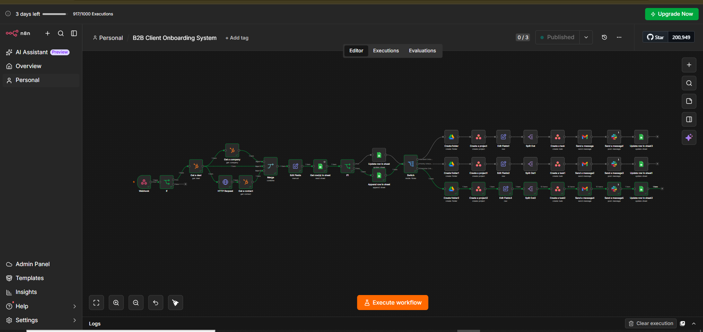
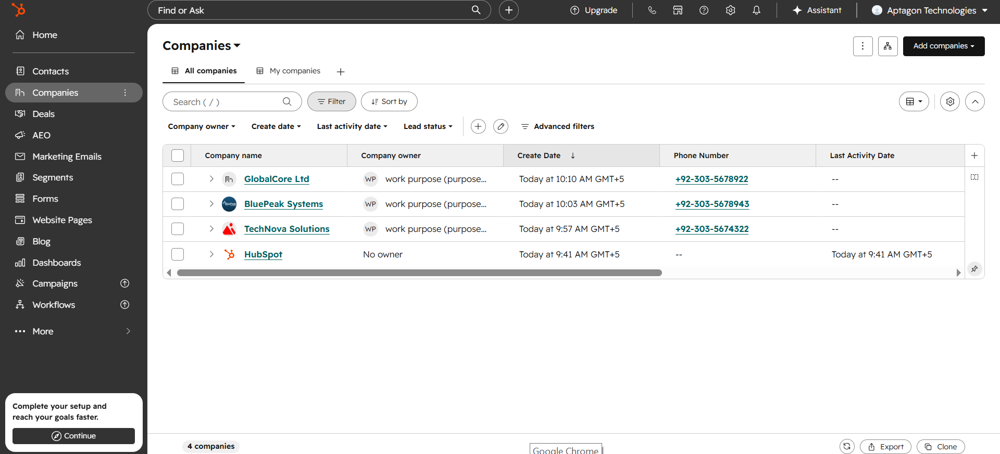
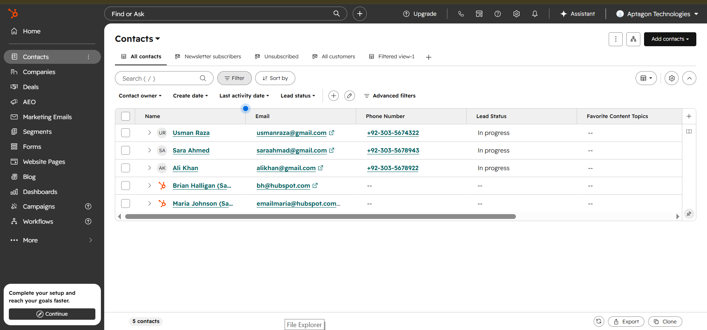
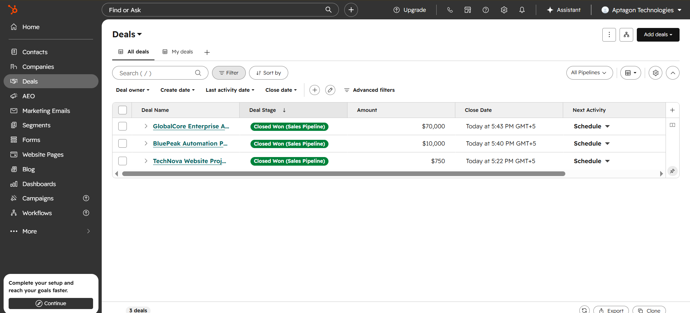
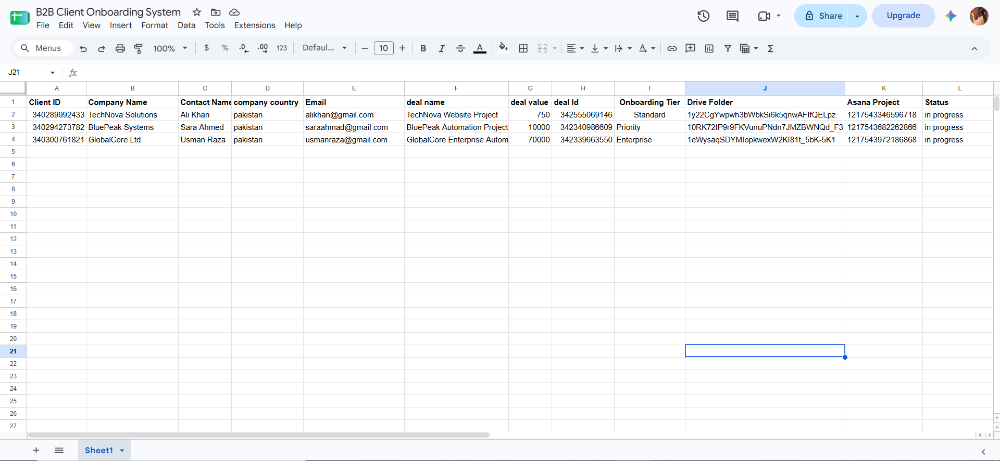
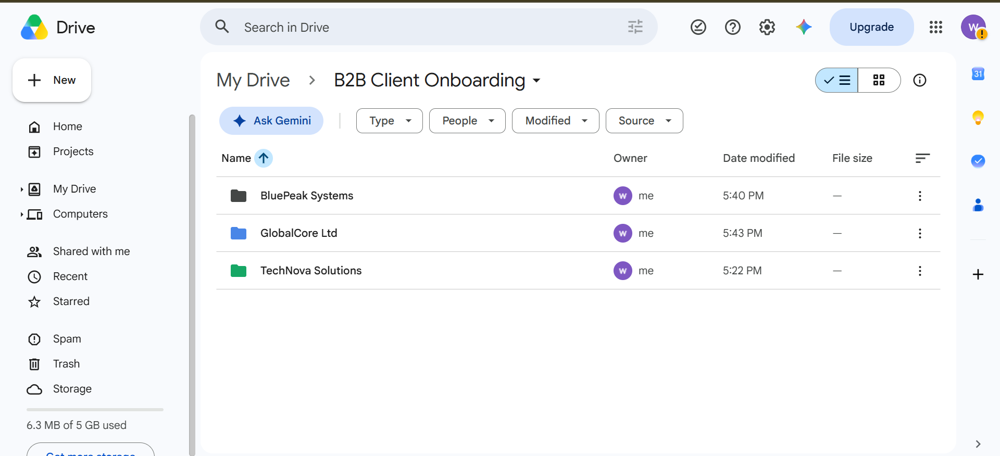
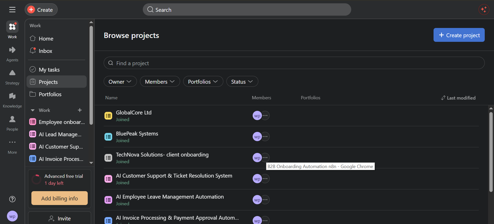
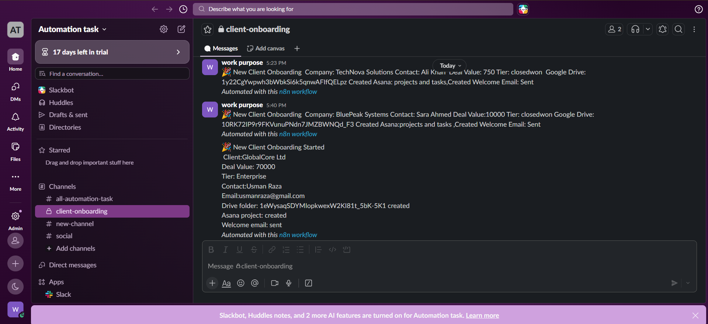
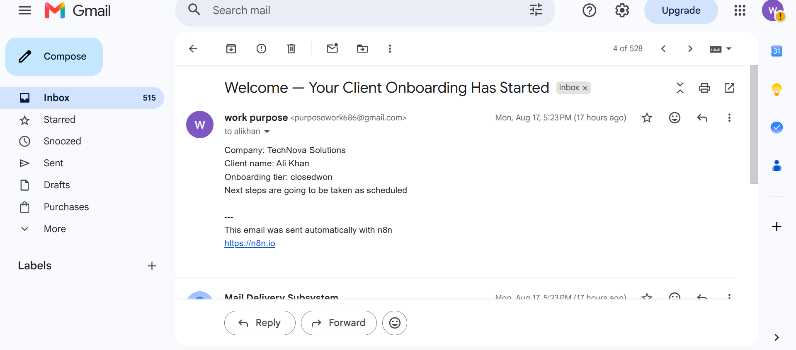

# 🚀 B2B Client Onboarding Automation

An end-to-end **B2B Client Onboarding Automation** workflow built with **n8n**, integrating HubSpot, Google Sheets, Google Drive, Asana, Slack, and Email.

The workflow automatically detects when a HubSpot deal reaches the `Closed Won` stage, retrieves the associated company and contact information, checks whether the client already exists, determines the onboarding tier based on deal value, creates the required onboarding resources, generates Asana tasks, sends notifications, and logs the onboarding status.

---

## 📌 Project Overview

Manual B2B client onboarding often requires multiple teams to perform repetitive tasks such as:

- Collecting client information
- Checking existing client records
- Creating client folders
- Creating project management tasks
- Sending welcome emails
- Notifying internal teams
- Updating tracking records

This automation connects these processes into a single workflow.

When a HubSpot deal is marked as **Closed Won**, the workflow retrieves the required information and automatically starts the appropriate onboarding process.

Deals that are not Closed Won are stopped and do not continue through the onboarding workflow.

---

## ✨ Key Features

### 🔔 HubSpot Deal Trigger

Receives HubSpot deal information through a webhook and starts the onboarding workflow automatically.

### ✅ Closed Won Validation

Checks whether the HubSpot deal stage is `Closed Won`.

- **Closed Won** → Continue with onboarding
- **Other stages** → Stop workflow

### 🏢 Company Information Retrieval

Retrieves the company associated with the deal, including:

- Company ID
- Company Name
- Country
- Domain

### 👤 Contact Information Retrieval

Retrieves the associated contact, including:

- Contact ID
- Contact Name
- Contact Email

### 🔗 Data Merging

Combines information from the HubSpot Deal, Company, and Contact into one workflow item.

### 🧹 Data Transformation

Uses n8n Edit Fields to create a clean client data structure containing:

- Company ID
- Company Name
- Company Country
- Deal ID
- Deal Name
- Deal Value
- Deal Stage
- Contact ID
- Contact Name
- Contact Email

### 🔍 Existing Client Check

Before creating a new client record, the workflow checks Google Sheets to determine whether the client already exists.

- **Client exists** → Update the existing client record
- **Client does not exist** → Create a new client record

### 💰 Deal Value Based Routing

The onboarding process is automatically classified based on deal value:

| Deal Value | Onboarding Tier |
|---|---|
| Less than $1,000 | Standard |
| $1,000 – $5,000 | Priority |
| Greater than $5,000 | Enterprise |

### 📁 Google Drive Folder Creation

Automatically creates a dedicated Google Drive folder for the client.

### 📋 Asana Project Creation

Automatically creates an Asana project for the client.

### 📝 Automated Task Creation

Creates predefined onboarding tasks according to the client's onboarding tier.

### 📧 Welcome Email

Automatically sends a welcome email to the client with onboarding information and next steps.

### 💬 Slack Notification

Notifies the internal team when a new client onboarding process has been created.

### 📊 Google Sheets Tracking

Stores and updates onboarding information in Google Sheets.

---

## 🏗️ Workflow Architecture

    HubSpot Deal
          ↓
    Webhook Trigger
          ↓
    IF: Deal Stage = Closed Won?
          │
          ├── FALSE → Stop Workflow
          │
          └── TRUE
                ↓
            Get Deal
                ↓
            Get Company
                ↓
            Get Contact
                ↓
            Merge Data
                ↓
            Edit Fields
                ↓
        Check Existing Client
                ↓
        Google Sheets Lookup
                ↓
        IF Client Exists?
             ┌──┴──┐
             ↓     ↓
           TRUE   FALSE
             ↓     ↓
        Update    Create
         Client   Client
             └──┬──┘
                ↓
        Check Deal Value
                ↓
             Switch
        ┌───────┼────────┐
        ↓       ↓        ↓
     Standard Priority Enterprise
        └───────┼────────┘
                ↓
       Create Google Drive Folder
                ↓
       Create Asana Project
                ↓
       Create Onboarding Tasks
                ↓
        Send Welcome Email
                ↓
        Slack Notification
                ↓
        Update Google Sheets
                ↓
       Onboarding Completed

---

## 🔀 Onboarding Tiers

### 🟢 Standard Onboarding

For deals below $1,000.

Tasks:

1. Send Welcome Email
2. Create Client Folder
3. Collect Client Information
4. Schedule Kickoff Meeting
5. Assign Onboarding Owner

### 🟡 Priority Onboarding

For deals between $1,000 and $5,000.

Tasks:

1. Send Priority Welcome Email
2. Create Client Folder
3. Collect Client Information
4. Schedule Priority Kickoff Meeting
5. Assign Priority Onboarding Owner
6. Configure Client Requirements
7. Priority Onboarding Review

### 🔴 Enterprise Onboarding

For deals above $5,000.

Tasks:

1. Send Enterprise Welcome Email
2. Create Enterprise Client Folder
3. Collect Enterprise Client Information
4. Schedule Executive Kickoff Meeting
5. Assign Enterprise Onboarding Team
6. Configure Enterprise Requirements
7. Stakeholder Alignment
8. Enterprise Implementation Setup
9. Enterprise Onboarding Review
10. Final Client Handoff

---

## ⚙️ n8n Features Used

The workflow demonstrates practical use of:

- Webhook
- IF
- HubSpot
- HTTP Request
- Merge
- Edit Fields
- Switch
- Google Sheets
- Google Drive
- Asana
- Split Out
- Email
- Slack
- Expressions
- JSON
- Data Transformation
- Conditional Routing
- Multi-Application Automation

---

## 🔄 Automated Asana Task Creation

Each onboarding tier stores its tasks as an array.

The Split Out node converts the task array into individual items.

A single Asana Create Task node then processes each item and creates the tasks automatically.

This approach avoids creating a separate Asana node for every task and makes the workflow easier to maintain and scale.

Example task structure:

    {
      "tasks": [
        {
          "name": "Send Welcome Email",
          "description": "Send the customer a welcome email with onboarding information."
        },
        {
          "name": "Create Client Folder",
          "description": "Create and organize the client's Google Drive folder."
        }
      ]
    }

---

## 📁 Google Drive Automation

For every Closed Won deal, the workflow creates a dedicated client folder.

The folder can be used to store:

- Client documents
- Onboarding resources
- Project files
- Agreements
- Other client-related information

The generated Google Drive folder information can also be stored in Google Sheets.

---

## 📋 Asana Automation

The workflow creates a dedicated Asana project for each client.

The project is then populated with predefined tasks based on the onboarding tier.

    Create Asana Project
            ↓
        Task Array
            ↓
          Split Out
            ↓
      Create Asana Task
            ↓
     Multiple Tasks Created

---

## 📧 Welcome Email

After the onboarding resources are created, the workflow sends a welcome email to the client.

The email can include:

- Company name
- Contact name
- Onboarding information
- Next steps
- Relevant onboarding resources
- Contact information

---

## 💬 Slack Notification

The internal team receives a Slack notification when onboarding starts.

The notification can contain:

- Company name
- Contact name
- Deal value
- Onboarding tier
- Google Drive folder
- Asana project
- Onboarding status

---

## 📊 Google Sheets Tracking

Google Sheets is used as the onboarding tracking system.

Example columns:

| Field | Description |
|---|---|
| Client ID | Client/company identifier |
| Company Name | Client company |
| Contact Name | Primary contact |
| Contact Email | Primary contact email |
| Deal Value | HubSpot deal amount |
| Onboarding Tier | Standard / Priority / Enterprise |
| Drive Folder | Generated Google Drive folder |
| Asana Project | Generated Asana project |
| Onboarding Status | Current onboarding status |

---

## 🧠 Business Logic

The main business rules are:

    IF Deal Stage != Closed Won
        → Stop Workflow

    IF Deal Stage = Closed Won
        → Retrieve Deal, Company and Contact

    IF Client Exists
        → Update Client Record

    IF Client Does Not Exist
        → Create Client Record

    IF Deal Value < $1,000
        → Standard Onboarding

    IF Deal Value >= $1,000 AND <= $5,000
        → Priority Onboarding

    IF Deal Value > $5,000
        → Enterprise Onboarding

---

## 🛠️ Technologies Used

- n8n
- HubSpot
- Google Sheets
- Google Drive
- Asana
- Slack
- Gmail / Email
- Webhooks
- HTTP APIs
- JSON
- JavaScript Expressions

---

## 🔗 Integrations

| Application | Purpose |
|---|---|
| HubSpot | CRM and deal information |
| n8n | Workflow automation and business logic |
| Google Sheets | Client records and onboarding tracking |
| Google Drive | Client folder creation |
| Asana | Project and task management |
| Gmail / Email | Client communication |
| Slack | Internal team notification |

---

## 🧪 Test Data

Example test deal:

| Field | Test Value |
|---|---|
| Deal Name | automation |
| Deal Stage | Closed Won |
| Deal Value | 50000 |
| Company | BluePeak.com |
| Country | Pakistan |
| Contact | Sara Ahmed |
| Email | saraahmad@gmail.com |

Since the deal value is $50,000, the workflow routes the client to:

**Enterprise Onboarding**

---

## 📤 Expected Successful Execution

A successful execution should produce:

    ✓ Deal verified as Closed Won
    ✓ Deal information retrieved
    ✓ Company information retrieved
    ✓ Contact information retrieved
    ✓ Client data merged
    ✓ Existing client checked
    ✓ Client created or updated
    ✓ Deal value evaluated
    ✓ Correct onboarding tier selected
    ✓ Google Drive folder created
    ✓ Asana project created
    ✓ Onboarding tasks created
    ✓ Welcome email sent
    ✓ Slack notification sent
    ✓ Google Sheets record updated

---

## ⚠️ Error Handling

Basic error handling is included in the workflow design.

Potential failure cases include:

- Deal is not Closed Won
- Company information is missing
- Contact information is missing
- Client already exists
- Deal value is missing or invalid
- Google Drive folder creation fails
- Asana project creation fails
- Email delivery fails
- Slack notification fails
- Google Sheets update fails

Possible future improvements include:

- Retry logic
- Error Trigger workflows
- Dedicated error logging
- Failed API request handling
- Automatic Slack error alerts
- Fallback processing
- Execution monitoring

---

## 🧪 Error-Handling Test

The workflow should also be tested with an invalid or incomplete input.

Example:

    Deal Stage: Negotiation
    Deal Value: 5000

Expected result:

    IF Deal Stage = Closed Won?
             ↓
           FALSE
             ↓
       Stop Workflow

No onboarding resources should be created.

---
## 📸 Screenshots

### 🔄 Workflow

### 🏢 HubSpot Company

### 👤 HubSpot Contact

### 💼 HubSpot Deal

### 📊 Google Sheets

### 📁 Google Drive

### 📋 Asana

### 💬 Slack

### 📧 Email

---
## 📂 Repository Structure

    B2B-Client-Onboarding-Automation/
    │
    ├── README.md
    │
    ├── workflow/
    │   └── b2b-client-onboarding.json
    │
    ├── screenshots/
    │   ├── 01-workflow-overview.png
    │   ├── 02-hubspot-deal.png
    │   ├── 03-hubspot-company.png
    │   ├── 04-hubspot-contact.png
    │   ├── 07-existing-client-check.png
    │   ├── 09-google-drive-folder.png
    │   ├── 10-asana-project.png
    │   ├── 11-asana-tasks.png
    │   ├── 12-welcome-email.png
    │   ├── 13-slack-notification.png
    │   ├── 14-google-sheets-log.png
    │   └── 15-error-handling-test.png
    │
    └── documentation/
        └── workflow-documentation.md

---

## ⚙️ Setup

### 1. Import the n8n Workflow

Import the workflow JSON file into your n8n instance:

    workflow/b2b-client-onboarding.json

### 2. Configure HubSpot

Configure HubSpot credentials in n8n.

The workflow requires access to:

- Deals
- Companies
- Contacts
- Associations

### 3. Configure Google Sheets

Create a client onboarding tracking sheet with the required columns.

Connect the Google Sheets credentials in n8n.

### 4. Configure Google Drive

Connect Google Drive credentials and select the appropriate parent folder.

### 5. Configure Asana

Connect Asana credentials and provide access to create projects and tasks.

### 6. Configure Email

Connect the required email service for sending welcome emails.

### 7. Configure Slack

Connect Slack credentials and select the internal notification channel.

---

## 🔐 Security

Sensitive credentials are not included in this repository.

Never commit:

- API keys
- OAuth tokens
- Client secrets
- Passwords
- Private webhook URLs
- Access tokens
- Private client information
- Personal client emails

Review the exported n8n JSON before uploading it to GitHub.

---

## 🎯 Project Goals

The main goals of this project are:

- Reduce manual client onboarding work
- Standardize onboarding processes
- Automatically create client resources
- Automatically create project tasks
- Route clients according to deal value
- Keep client information organized
- Improve internal communication
- Maintain centralized onboarding records
- Demonstrate multi-application workflow automation
- Build a reliable and scalable automation architecture

---

## 📈 Scalability

The workflow is designed so additional onboarding tiers, tasks, integrations, and business rules can be added without rebuilding the entire workflow.

The use of:

- Switch
- Edit Fields
- Split Out
- Reusable task arrays
- API integrations
- Centralized tracking

makes the automation easier to maintain and extend.

---

## 🚀 Future Improvements

Possible future enhancements include:

- Automated onboarding status tracking
- Automatic task deadline calculation
- Automated onboarding reminders
- Duplicate client detection improvements
- Retry logic
- Advanced error handling
- AI-powered client requirement analysis
- AI-generated welcome emails
- Automated document generation
- Client portal creation
- Onboarding analytics dashboard
- Automated follow-up emails
- Onboarding completion detection
- Customer feedback collection

---

## 📚 Skills Demonstrated

This project demonstrates practical experience with:

- Workflow Automation
- n8n
- HubSpot CRM
- REST APIs
- Webhooks
- API Integration
- Data Transformation
- JSON
- JavaScript Expressions
- Conditional Logic
- IF Nodes
- Switch Nodes
- Merge Nodes
- Split Out
- Google Sheets
- Google Drive
- Asana
- Slack
- Email Automation
- CRM Automation
- Project Management Automation
- Business Process Automation
- Error Handling
- Workflow Scalability

---

## 👩‍💻 Author

**Syeda Ramisha Ihtisham**

BS Computer Science  
AI Automation Engineer Intern

---

## ⭐ Project Summary

This project demonstrates an end-to-end **B2B Client Onboarding Automation System** that transforms a HubSpot `Closed Won` deal into a structured onboarding process.

The workflow automatically checks and manages client records, routes clients based on deal value, creates Google Drive resources, creates Asana projects and tasks, communicates with clients, notifies internal teams, and maintains onboarding records in Google Sheets.

**Built with n8n and multiple business application integrations.**
